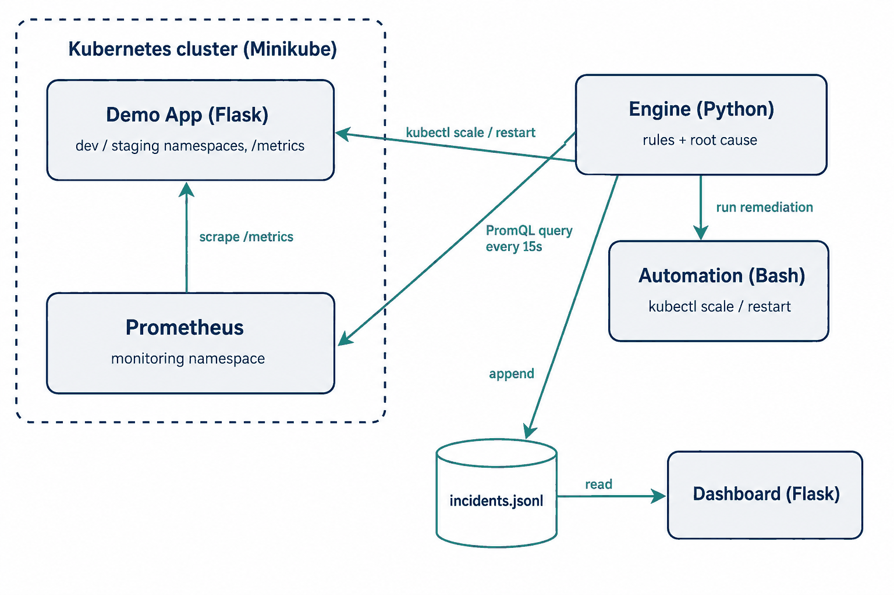
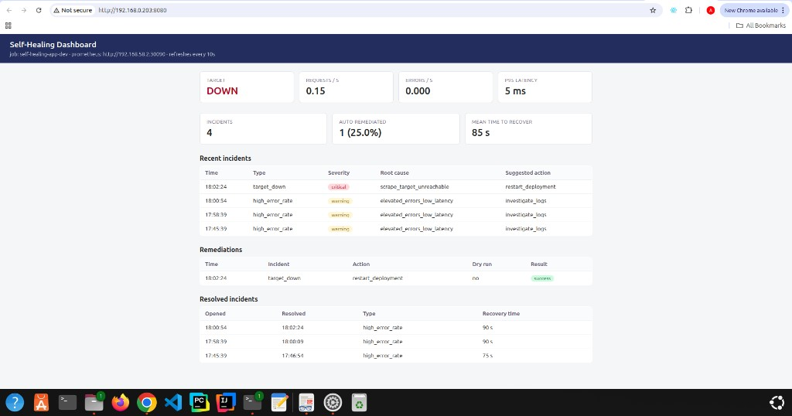

# Self-Healing Infrastructure with Incident Response

A monitoring and auto-remediation setup for Kubernetes. Prometheus scrapes a
demo web service, a Python engine watches the metrics, classifies incidents
with a small rule-based root-cause step, and fixes the common cases itself by
restarting or scaling the deployment. Everything that happens is written to an
incident log and shown on a web dashboard.

**Stack:** Python, Kubernetes (Minikube), Prometheus, Terraform, Docker, Bash, GitHub Actions

## How it works



1. The demo app (`app/`) exposes request, error and latency metrics on `/metrics`.
2. Prometheus (installed by Terraform via Helm) scrapes it in the `dev` and `staging` namespaces.
3. The engine (`engine/`) polls Prometheus and evaluates three rules:

| Signal | Root cause | Action |
|---|---|---|
| target down (`up == 0`) | pod unreachable | restart deployment |
| high error rate + high p95 latency | overload | scale deployment |
| high error rate, normal latency | likely app bug | flag for investigation (scaling won't help) |
| high p95 latency only | approaching overload | scale deployment |

4. Remediation runs through the Bash scripts in `automation/`, with a cooldown
   so it never restarts/scales in a loop, a replica cap, and a dry-run mode
   that is **on by default**.
5. Each incident is logged once when it opens and once when the metric
   recovers, so the log gives real numbers: incident count, how many were
   auto-remediated, and mean time to recover.

## Repo layout

```
app/          demo Flask service with Prometheus metrics (+ /error and /slow test endpoints)
engine/       monitoring loop, rules, incident log, unit tests
dashboard/    read-only web UI: live metrics, incidents, remediations, MTTR
automation/   kubectl scale/restart scripts (dry-run by default)
k8s/          kustomize base + dev/staging overlays
terraform/    namespaces (dev, staging, monitoring) + Prometheus Helm release
monitoring/   Prometheus Helm values (scrape configs, NodePort)
scripts/      deploy.sh, inject_errors.sh
```

## Running it

Needs Docker, Minikube, kubectl, Terraform and Python 3.10+.

**1. Cluster + infrastructure**

```bash
minikube start
cd terraform && terraform init && terraform apply && cd ..
```

This creates the `dev`, `staging` and `monitoring` namespaces and installs
Prometheus (NodePort 30090).

**2. Deploy the app**

```bash
./scripts/deploy.sh dev        # or: ./scripts/deploy.sh staging
minikube service self-healing-app -n dev --url
```

**3. Start the engine**

```bash
cd engine
python3 -m venv .venv && source .venv/bin/activate
pip install -r requirements.txt

export PROMETHEUS_URL=http://$(minikube ip):30090
export REMEDIATE=1                 # actually run remediation scripts
export REMEDIATE_DRY_RUN=false     # false = real kubectl commands
python3 main.py
```

The engine prints one JSON line per event and appends everything to
`data/incidents.jsonl`.

**4. Dashboard (optional)**

```bash
cd dashboard
pip install -r requirements.txt
export PROMETHEUS_URL=http://$(minikube ip):30090
python3 app.py                     # http://localhost:8080
```

## Demo: break it and watch it heal

```bash
# terminal 1: engine running with REMEDIATE=1 (see above)

# terminal 2: generate errors against the dev app
./scripts/inject_errors.sh http://$(minikube ip):30051 200
```

Within a poll or two the engine opens a `high_error_rate` incident, decides on
a remediation and runs the matching script. When the error rate drops back
under the threshold it logs the incident as resolved with the recovery time.
You can watch all of it on the dashboard, or check the totals with:

```bash
cd engine && python3 summarize.py
```

To simulate a crash instead, scale the app to zero
(`kubectl scale deployment/self-healing-app -n dev --replicas=0`) — the
`target_down` rule triggers a rollout restart.

Here's the dashboard after a demo run — a `target_down` incident was detected
and auto-remediated with a rollout restart, plus a few `high_error_rate`
incidents that were correctly classified as "scaling won't help, check the
logs" and left alone:



## Configuration

All engine settings are environment variables (defaults in `engine/config.py`):

| Variable | Default | Meaning |
|---|---|---|
| `PROMETHEUS_URL` | `http://127.0.0.1:9090` | Prometheus base URL |
| `APP_JOB` | `self-healing-app-dev` | scrape job to watch (`-staging` for staging) |
| `POLL_INTERVAL_SECONDS` | `15` | how often to evaluate rules |
| `ERROR_RATE_THRESHOLD` | `0.05` | errors/s that count as an incident |
| `LATENCY_P95_THRESHOLD_SECONDS` | `0.5` | p95 latency threshold |
| `REMEDIATE` | `0` | `1` = engine may run remediation scripts |
| `REMEDIATE_DRY_RUN` | `true` | `true` = only print the kubectl command |
| `REMEDIATE_COOLDOWN_SECONDS` | `120` | minimum gap between two runs of the same action |
| `SCALE_TARGET_REPLICAS` / `SCALE_MAX_REPLICAS` | `3` / `5` | scale target and hard cap |

## Tests and CI

```bash
cd engine && python3 -m unittest -v
```

GitHub Actions runs on every push/PR: engine unit tests, Docker build with an
endpoint smoke test, `kubectl kustomize` build of both overlays, and
`terraform fmt`/`validate` (no cloud credentials needed).

## Design notes

- **Dry-run by default.** Anything that touches the cluster only prints the
  command unless you explicitly opt in. Automation that can scale or restart
  things should be safe to run by accident.
- **Cooldowns and caps.** The engine won't fire the same action twice inside
  the cooldown window, and the scale script refuses to go past `MAX_REPLICAS`.
- **Terraform for infra, kustomize for the app.** Namespaces and Prometheus
  are long-lived infrastructure; app deploys happen much more often, so they
  go through a separate, faster path.
- **Rules, not ML.** "AI-driven" here is a deliberately simple rule engine.
  For the failure modes this covers, rules are debuggable and predictable;
  swapping in something smarter would only mean changing `engine/rules.py`.

## Limitations / ideas

- Rules only look at instant values; no trend detection or dedup across restarts.
- No log correlation (Loki/ELK) — root causing is metrics-only.
- Alerting integration (Slack webhook) would be the next practical addition.

## License

MIT — see [LICENSE](LICENSE).
